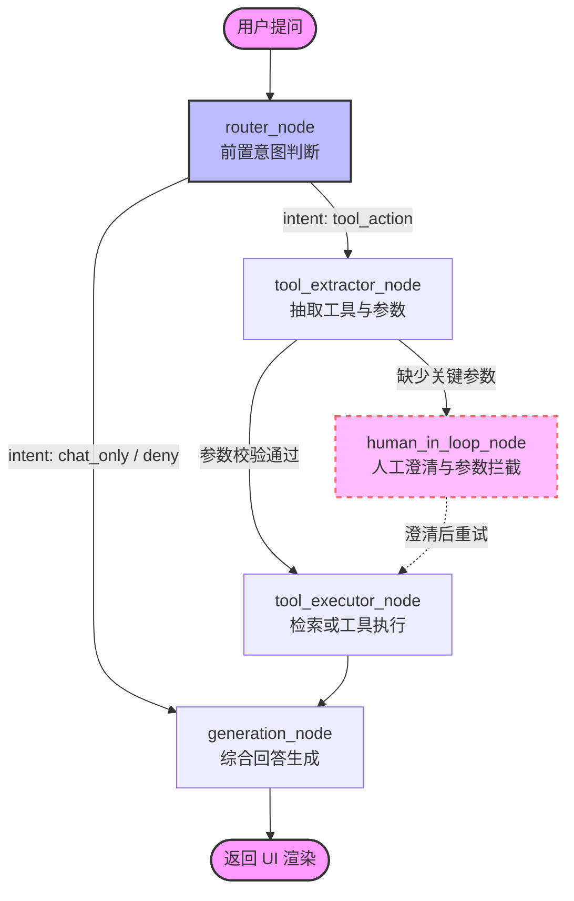

# 01 架构细节与数据流转 (Architecture & Data Flow Details)

本文档旨在为开发者提供本项目核心模块的具体技术实现规范、API 接口定义及数据流转结构，确保各模块开发时的数据契约一致性。

---

## 1. 核心数据结构契约 (Core Data Schema)

系统在数据接入 (Ingest) 阶段生成的核心数据单元为 `BaseNode`。为了支撑前端界面的“可验证交互（点击引用跳转原文）”（`P2` 必做），系统强制所有 Node 必须遵循以下 `metadata` 契约：

```python
# 数据契约示例（必选键 + 常见内部键）
node.metadata = {
    "source": "2023_Tesla_Annual_Report.pdf",  # [必选] 原始文档名，用于分组过滤与展示
    "page_label": "42",                        # [必选] 物理页码，用于 iframe 动态跳转
    "chunk_strategy": "fixed_256",             # [内部] 记录分块策略 (fixed_256 / semantic)
    # RAPTOR / 摘要节点：具体键名以 RaptorPack 与切块管线为准；Gradio 引用区使用 is_summary 控制展示
    "is_summary": False,                       # [内部，可选] UI 溯源卡片中「宏观摘要」徽标（见 src/ui/app.py）
}
```

---

## 2. 数据接入与分块模块 (`src/ingest/`)

### 2.1 PDF 解析 (`pdf_parser.py`)
- **核心工具**: 强制使用 `PyMuPDFReader`（优先于 `SimpleDirectoryReader` 默认的 PyPDF），因其对页码 `page_label` 的提取更为稳定。
- **输入**: 存放研报的本地目录路径。
- **输出**: `List[Document]`。每个 Document 对应 PDF 的一页或整篇，且 metadata 中携带正确的 `source` 和 `page_label`。

### 2.2 分块策略分发 (`chunker.py`)
本模块是系统“自适应分块”实验的核心战场，提供统一的切块入口：

- **基线分块 (Phase 1)**: 
  使用 LlamaIndex 的 `SentenceSplitter`。
  - `chunk_size` = 256
  - `chunk_overlap` = 25
- **语义分块 (Phase 2)**: 
  使用 `SemanticSplitterNodeParser`。
  - 依赖 `BAAI/bge-m3` 提供的嵌入向量计算句间余弦相似度。
  - `breakpoint_percentile_threshold` = 95。

---

## 3. 存储与多路检索模块 (`src/retrieval/`)

### 3.1 向量数据库与持久化 (`indexer.py`)
- **核心组件**: ChromaDB (`chromadb.PersistentClient`)。
- **隔离策略**: 针对不同的分块策略，系统必须建立不同的 Collection 物理隔离（如：`phase1_fixed_256` 集合，`phase2_semantic` 集合），避免混合检索导致数据污染。
- **RAPTOR 树状构建 (Phase 2)**: 启用时，调用 LlamaIndex 的 `RaptorPack`，并注入 `DeepSeek API` 模型作为 `summary_model` 进行后台层级摘要。

### 3.2 混合召回与精排 (`retriever.py`)
- **Phase 1 (单路检索)**: 直接使用 `VectorStoreIndex.as_retriever(similarity_top_k=5)`。
- **Phase 2 (多路混合检索)**:
  1.  **Dense 召回**: `VectorIndexRetriever(top_k=20)`
  2.  **Sparse 召回**: 基于 LlamaIndex `BM25Retriever` (需在内存中维护完整的 Node 列表，`top_k=20`)
  3.  **融合 (RRF)**: 使用 `QueryFusionRetriever` 合并上述两路召回结果。
  4.  **精排 (Cross-Encoder)**: 将融合后的 Top-N 传入 `SentenceTransformerRerank(model="BAAI/bge-reranker-base", top_n=5)`，最终只向大模型输入前 5 个高分片段。

---

## 4. 生成与交互模块 (`src/generation/` & `src/ui/`)

### 4.1 对话引擎与记忆池 (`pipeline.py`)
系统不使用最简单的 `query_engine`，而是使用能够处理多轮对话的带状态引擎。
- **核心组件**: `CondensePlusContextChatEngine`。
- **记忆管理**: 注入 `ChatMemoryBuffer(token_limit=4096)`。
- **工作机制**: 当用户提出带代词的问题（如“它的风险是什么？”）时，引擎会自动提取 `ChatMemoryBuffer` 中的历史对话，利用 LLM 将问题重写为无歧义的独立 Query（如“Tesla 2023年的风险是什么？”），再送入底层检索器。

### 4.2 严格引用 Prompt 设计
大模型的 Context Prompt 必须内置极其严格的“反幻觉”与“强制引用”指令：
> "你是一个严谨的金融分析师。仅使用提供的研报片段作答。若片段信息不足，必须回答'基于当前源文档暂未找到关联信息'。**回答末尾必须严格按照以下格式标注出处：【来源：{source} 第{page_label}页】。**"

### 4.3 可验证交互（P2 必做）
- UI 必须支持“点击引用 -> 右侧 PDF 预览跳转到对应页码”的联动。
- 当引用信息缺失或页码无效时，前端需给出降级提示，不得静默失败。

---

## 5. LangGraph 状态转化架构 (Phase 2+ 更新)

为了解决原先 `LlamaIndex ReAct` 导致的高延迟和黑盒调试问题，系统的核心交互逻辑已迁移至基于 **LangGraph** 的显式状态图编排架构 (`src/generation/graph.py`)。

### 5.1 核心机制亮点
1. **单图拍平设计**：所有流转挂载于全局 `ChatGraphState`，提升调试便利性。
2. **前置路由 (TTFT 优化)**：引入 `RouterNode` 先判定意图 (`chat_only`, `deny`, `tool_action`)，闲聊类提问绕过沉重的 RAG 检索管线。
3. **参数校验与护栏**：提取槽位后，在 `tool_executor_node` 中强制前置检查 `tool_params`。当必要参数缺失时，支持触发 Human-in-the-loop (HITL) 反问机制或错误处理。
4. **Langfuse 深度可观测**：在流程节点引入 `@observe()` 装饰器，实现整个 RAG + Tool Call 链路的精准埋点追踪。

### 5.2 状态契约 (ChatGraphState)
```python
class ChatGraphState(TypedDict):
    messages: List[ChatMessage]          # 历史对话和当前请求
    intent: str                          # 路由意图: chat_only, deny, tool_action
    tool_name: str                       # 提取的工具名称
    tool_params: Dict[str, Any]          # 工具参数槽位
    tool_results: List[Any]              # 工具返回的数据
    final_response: str                  # 最终回答
    citations: List[Dict[str, Any]]      # 溯源信息
```

### 5.4 前置意图判断机制 (Router Node)

为了极大提升首字响应速度 (TTFT) 并避免对无需工具介入的请求（如闲聊、寒暄）强行触发沉重的 RAG 检索管线，系统在 LangGraph 的入口节点 `router_node` 中实现了前置意图判断。

#### 1. 工作原理 (Zero-shot Classification)
当系统接收到用户的最新提问时，会利用系统中配置的弱模型 (`weak_model`) 发起一次极轻量级的分类推理。使用的底层指令类似于：
> "分析以下用户的请求意图。如果只是打招呼或闲聊返回 'chat_only'；如果涉及查股价或查研报返回 'tool_action'；如果是恶意或无理要求返回 'deny'。"

#### 2. 分流策略与收益
根据小模型的分类结果，`ChatGraphState` 的 `intent` 字段会被更新，随后通过条件边 (`add_conditional_edges`) 执行分流：
- **`chat_only` / `deny` 分支**：请求被直接路由到 `generation_node`。大模型仅基于自身预训练知识和安全护栏直接回复，**响应时间极低**。
- **`tool_action` 分支**：请求才会被放行进入后续的 `tool_extractor_node` 进行槽位抽取和高成本的向量/混合检索环节。

**工业级演进方向**：在后续高并发需求下，此基于 Prompt 的生成式分类可平滑替换为微调过的轻量级 Embedding 或 Bert-style 判别式分类器，以实现毫秒级的纯本地拦截。



当用户发送提问时，系统遵循**“意图判断 -> 参数提取 -> 护栏校验 -> 执行 -> 总结”**的高度确定的流水线：

1. **`router_node` (起点：前置意图路由)**
   - **机制**：接收输入后，先调用模型进行一次极速的意图分类。
   - **路由分支 (`route_after_analysis`)**：
     - 若为 **`chat_only`**（闲聊）或 **`deny`**（越界拒绝），则**直接短路**跳过检索和工具层，流入 `generation_node`。
     - 若为 **`tool_action`**（需查研报或股价），则流入 `tool_extractor_node`。

2. **`tool_extractor_node` (槽位提取)**
   - **机制**：判断并提取工具及参数（如判断调用 `fetch_stock` 提取 `ticker`，或 `retrieve_report`）。
   - **护栏分支 (`route_after_extraction`)**：
     - 若关键参数缺失（如查股票无代码），导向 **`human_in_loop_node`** 触发拦截或澄清。
     - 若参数齐全，导向 `tool_executor_node`。

3. **`tool_executor_node` (工具执行与校验)**
   - **机制**：执行硬性代码逻辑检查。校验通过后，真正调用外部 API (雅虎金融) 或 LlamaIndex 检索器召回研报。结果存入 `tool_results`，随后无条件流向生成节点。

4. **`generation_node` (终点：综合生成)**
   - **机制**：汇总状态图上的信息。若是检索研报，将召回的 Nodes 解析组装至严格的 `QA_PROMPT_TEMPLATE` 中让 LLM 基于证据回答，并提取 metadata 生成 `citations` 溯源链。若是短路拦截，则直接输出对应话术。执行完毕后流向 `END` 并返回 UI。